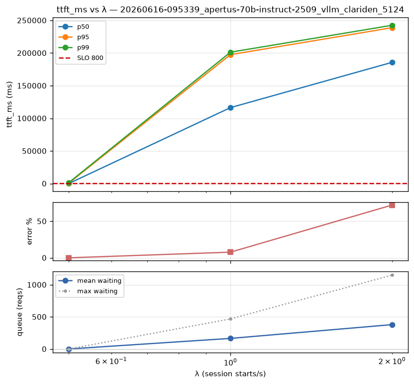
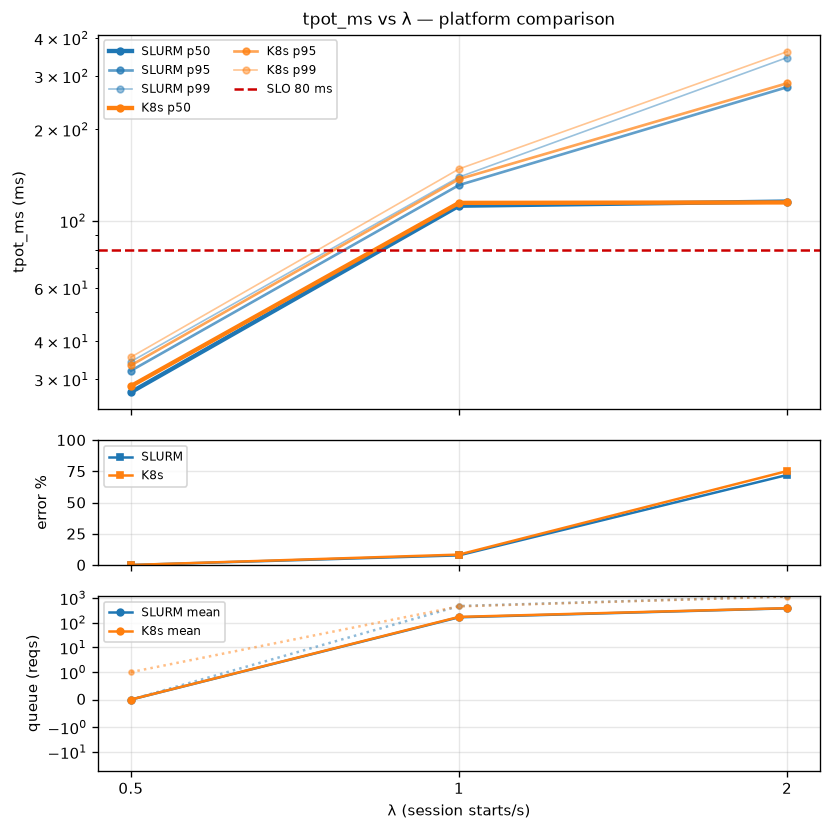
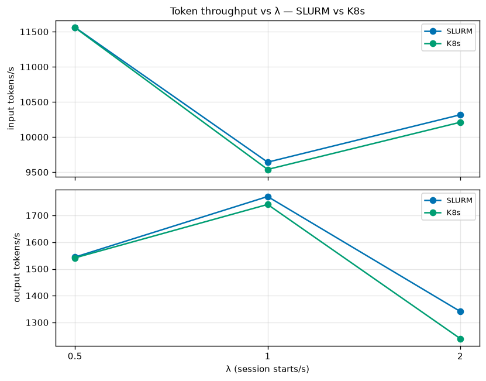
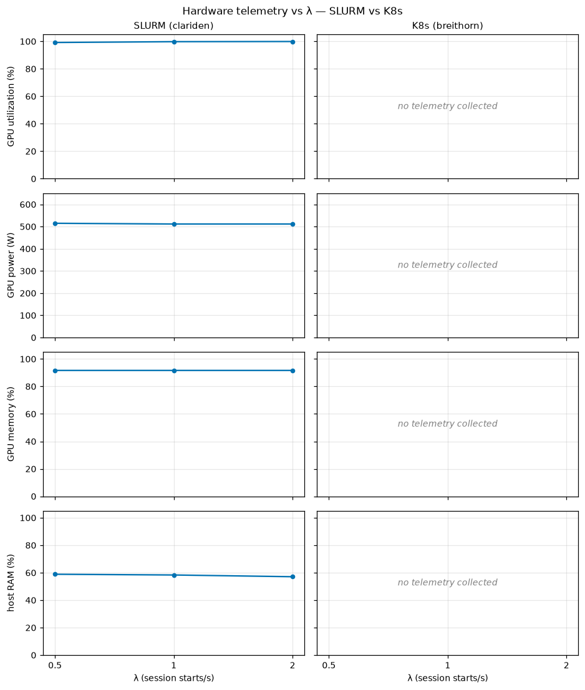

# Apertus-70B (256k context) - single-node baseline (SLURM vs K8s)

## Contents

1. [Pre-checks (§8 foundation gate)](#1-pre-checks-8-foundation-gate)
2. [Model-loading time breakdown (§10.2)](#2-model-loading-time-breakdown-102)
3. [Loading scenario (the benchmark workload)](#3-loading-scenario-the-benchmark-workload)
4. [Capacity & throughput](#4-capacity--throughput)
5. [Hardware saturation (telemetry)](#5-hardware-saturation-telemetry)
6. [Saturation onset = queue onset](#6-saturation-onset--queue-onset)
7. [Quality (§13.5) — gsm8k](#7-quality-135--gsm8k)
8. [Conclusions](#8-conclusions)
   - [Supportable users at λ\* = 0.5 session-starts/s](#supportable-users-at-λ--05-session-startss-single-gh200-node)
   - [Platform parity](#platform-parity)
- [Disclosures & limitations](#disclosures--limitations-not-hidden-per-153)
- [Provenance](#provenance)

**Purpose.** Establish the **baseline operating point** for Apertus-70B served on a single GH200 node,
run at a **256K context window to approximate the upcoming Apertus-70B 1.5** (which will natively
support 256K). This checkpoint is natively 64K, so the 256K window is **forced**
(`VLLM_ALLOW_LONG_MAX_MODEL_LEN`; see Disclosures). This is the **reference against which the
KV-offloading and fp8 cells of the grid will be compared** (capacity and quality deltas, §15.1), and
the first run of a **SLURM-vs-K8s platform comparison** of the identical deployment.

**Setup.**

| | |
|---|---|
| Model | `swiss-ai/Apertus-70B-Instruct-2509` (70B dense), full **256K** context (`max_model_len=262144`) |
| Engine | vLLM **0.23.0**, TP4 × PP1 on **one GH200 node** (4× GH200, intra-node NVLink-C2C) |
| Image | `jfrog.svc.cscs.ch/ml/inference/vllm:0.23.0-alps.net.v1-gh200` — official base image vLLM 0.23 + [Alps Slingshot-11 netstack](../../tools/images/core/nvidia/netstack/v1) + baked Ray/NIXL/LMCache; self-contained (host CXI hook off) |
| Storage | weights from the **capstor** Lustre HF-cache (`/capstor/scratch/.../ibt/hf-cache`); dataset pool on capstor. (K8s variant: weights from a `ceph-corbo-cephfs` PVC.) |
| Platforms | **SLURM** (clariden) + **Kubernetes** (breithorn) — both complete; compared in §8 |

## 1. Pre-checks (§8 foundation gate)

The §8 gate runs **before** the engine is admitted, so neither platform's sweep can measure a degraded
foundation. **Both platforms passed and were admitted.** SLURM (one srun step per rank) persists the
measured values to the run DB; **K8s ran the same gate in-pod (decision-9 `torch.distributed` probe) and
was admitted, but the values are not persisted cross-cluster** — so only pass/admit is known for K8s (an
instrumentation gap to close, §8).

| check | SLURM (clariden) | K8s (breithorn) | reference |
|---|---|---|---|
| NCCL all-reduce @128 MiB | 309.5 GB/s ✅ | ❓ not captured | 317.7 |
| NCCL all-gather @128 MiB | 278.9 GB/s ✅ | ❓ not captured | 283.5 |
| NCCL all-to-all @128 MiB | 307.8 GB/s ✅ | ❓ not captured | 306.2 |
| NVSHMEM all-to-all latency @128 KiB *(not relevant for this model)* | 12.68 µs ✅ | ❓ not captured | — |
| sequential read (single-stream O_DIRECT) | 0.197 GB/s ✅ (capstor) | ❓ not captured (CephFS PVC) | floor 0.063 |
| parallel read (8-stream O_DIRECT) | 1.01 GB/s ✅ (capstor) | ❓ not captured (CephFS PVC) | — |
| buffered read (readahead) | 14.32 GB/s ✅ (capstor) | ❓ not captured (CephFS PVC) | — |

*(K8s passed the gate and was admitted — only the numeric values weren't persisted cross-cluster; ❓ = "not collected", not "failed".)*

SLURM: intra-node NVLink collectives at reference; capstor storage healthy (well above the degraded
floor). K8s storage rides a different mount (the `ceph-corbo-cephfs` weights PVC). Foundation sound on
both → the capacity numbers below reflect the engine, not a broken substrate.

## 2. Model-loading time breakdown (§10.2)

| component | SLURM (clariden) | K8s (breithorn) |
|---|---|---|
| **time-to-ready** | **314 s** | *not captured* (see below) |
| weights load | 108 s — 32.9 GiB → **0.30 GB/s effective** | — |
| engine init (profile + KV alloc + warmup) | 37 s | — |
| CUDA-graph capture | 14 s — full graphs, custom all-reduce **on** (no E2b workarounds on 0.23) | — |
| inductor compile | 12 s | — |

**SLURM** has the full breakdown because the benchmarker spawns the engine and parses its log. **K8s is
not captured**: the engine is deployed externally (kubectl) and finishes loading *before* the benchmarker
attaches over the ingress, so the breakdown isn't read cross-cluster — the recorded `model_load_total_s`
(110 s) is only the benchmarker's *ingress-readiness wait*, not the model load (follow-up: parse
`kubectl logs`, §8). On SLURM, the effective weight-load bandwidth (0.30 GB/s) is **well below** the §8
parallel-read floor on the same mount (1.01 GB/s) → the load is **deserialization / single-stream-limited,
not mount-bandwidth-bound** (a cold-start optimisation target, not a storage problem).

## 3. Loading scenario (the benchmark workload)

A realistic **mixed** workload, weighted by session starts (§12.3):

- **80% `chat-short-turns`** — short interactive turns (turn-1 ≈ 500 tokens).
- **20% `agentic-coding`** — long coding sessions (turn-1 ≈ 10 000 tokens).

Both are **multi-turn** with true conversational growth (`append_delta`: turn *N*'s prompt = the full
prior transcript, including the model's own outputs, + the new turn), so a session's context **grows
turn-over-turn** toward the 256K window — and *not every session fills it* (turn counts and lengths are
drawn from per-scenario distributions). Prompts are **real text**: chat from **WildChat-1M**, agentic
from **LongBench**. The pool is **100 000 turn records** (seed 1234, forced output length for sweep
reproducibility), generated once and shared across cells.

Load is offered as a **Poisson** arrival of session starts at rate **λ**, swept
`[0.5, 1, 2, 4, 8, 16]` sessions/s with **warmup 300 s / measurement 600 s / drain 600 s** per level.
The sweep uses the **sustained-queue adaptive early-stop** (§12.2): once the request queue is
persistently non-empty for two consecutive levels, the remaining higher λ are skipped as redundant
deep-overload.

**The exact same load was offered to both deployment targets.** SLURM and K8s used the **same
byte-identical 100k pool** (generated once on capstor, reused), the **same** arrival process, λ ladder,
phase timings, and seeds — so any SLURM-vs-K8s difference in the results is the **serving stack**, not the
workload.

## 4. Capacity & throughput

**TTFT** (time-to-first-token) — **SLURM (left) vs K8s (right)**, panels latency / error / queue, y-axes
shared per row:

**TPOT** (time-per-output-token) — same side-by-side layout:

- **Supportable load: λ\* = 0.5 session-starts/s on BOTH platforms** — the only swept level meeting **all**
  per-class SLOs. Values shown per platform as **SLURM / K8s**:

| λ (sessions/s) | chat TTFT p95 (SLO 800 ms) | chat TPOT p95 (SLO 80 ms) | agentic e2e p90 (SLO 600 s) | error % (SLO 1%) | verdict (both) |
|---|---|---|---|---|---|
| **0.5** | **461 / 569 ms** ✅ | **32 / 33 ms** ✅ | **208 / 215 s** ✅ | **0 / 0 %** ✅ | ✅ **λ\*** |
| 1.0 | 197 782 / 202 154 ms ❌ | 131 / 138 ms ❌ | 639 / 696 s ❌ | 8 / 8 % ❌ | ❌ saturated |
| 2.0 | 238 519 / 236 238 ms ❌ | 276 / 281 ms ❌ | 826 / 837 s ❌ | 72 / 75 % ❌ | ❌ deep overload |
| 4 / 8 / 16 | — | — | — | — | **skipped** (early-stop, both) |

Both platforms behave identically: at λ=0.5 all SLOs pass (K8s marginally higher — e.g. chat TTFT p95
569 vs 461 ms, still well under 800), and at λ=1.0 both are already catastrophically saturated (TTFT p95
~0.5 s → ~200 s). λ\* is **bracketed but coarse** — only one sub-knee point (0.5) was measured; a
refinement pass (λ = 0.6 / 0.7 / 0.8) is needed for a precise λ\*.

**Token throughput** vs λ (input tokens/s top, output tokens/s bottom; SLURM blue, K8s orange):

Token throughput sits at the **engine's ceiling** across the measured range (~10–11k input / ~1.3–1.8k
output tokens/s), with **SLURM and K8s nearly identical** — the engine, not the platform, sets the
ceiling. It is **not monotonic in λ**: past the knee, multi-turn sessions throttle (sequential follow-ups
wait on slow responses) and deep overload thrashes (preemption), so delivered tokens/s flatten and dip
rather than climb. (Input ≫ output: the agentic share carries large prompts vs short forced outputs.)

## 5. Hardware saturation (telemetry)

GPU telemetry sampled during the sweep (§13.3), **SLURM (left) vs K8s (right)** — utilization and power
per λ; the K8s panels are empty (no telemetry collected, see below):

| signal (SLURM, per λ) | λ=0.5 | λ=1.0 | λ=2.0 |
|---|---|---|---|
| GPU utilization (mean %) | **99.2** | 99.8 | 99.9 |
| GPU power (mean W/GPU) | **515.0** | 511.7 | 511.7 |
| GPU memory (mean %) | 91.7 | 91.7 | 91.7 |
| GPU temperature (mean °C) | 47.2 | 48.2 | 48.6 |

**The GH200 is never idle, even at the lightest load.** GPU utilization sits at **~99–100% already at
λ\*=0.5** — the level where every SLO still passes — and stays there as load climbs. But `utilization.gpu`
is a coarse signal: it is the **fraction of time at least one kernel was running**, not how much of the GPU
was used — so it shows the GPU was **never idle**, *not* that it was compute-saturated, and it **cannot tell
us which resource is the bottleneck** (SM occupancy vs tensor-core duty cycle vs HBM bandwidth). For
70B-dense serving these differ by phase — prefill (the long agentic prompts) is compute-heavy, decode is
typically **HBM-bandwidth-bound** — and only the DCGM counters (all `NULL` here, see below) would resolve it.
What we *can* say: there is **no idle headroom** at any swept level, the token throughput is flat at the
engine ceiling (§4), and the SLO knee past λ\* is **queueing** (§6), not a drop in utilization. Power is
steady at **~512 W/GPU** (peak 563.9 W) with temperatures ~47–49 °C — **no thermal throttling**, well within
the GH200 envelope. GPU memory reads a constant **91.7%** because the KV cache is **pre-allocated** at
startup (`gpu_memory_utilization=0.90`), so it is "full" by construction rather than a load-dependent signal.

**Telemetry limits (disclosed, not findings):** the image ships only coarse `nvidia-smi` counters
(utilization / power / memory / temperature). The fine-grained **DCGM** signals — SM-active %, tensor-core
active %, HBM bandwidth, NVLink and PCIe — are **not wired** in this image (`NULL` in `hardware_stats`), so
GPU utilization **cannot be decomposed** into SM-active vs memory-stall time (a profiling follow-up, §8).
**K8s collected no telemetry at all**: the in-pod sampler writes the pod's `/results` PVC, which the
clariden benchmarker never reads cross-cluster (same gap as §1/§2; K8s `hardware_stats`=0 rows) — hence the
empty right-hand panels.

## 6. Saturation onset = queue onset

Mean / max request queue (`requests_waiting`), per platform as **SLURM / K8s**:

| λ | mean queue — SLURM / K8s | max queue — SLURM / K8s | all SLOs met? (both) |
|---|---|---|---|
| 0.5 | **0.0 / 0.0** | 0 / 1 | ✅ yes |
| 1.0 | 164 / 170 | 468 / 453 | ❌ no |
| 2.0 | 379 / 385 | 1150 / 1135 | ❌ no |

On both platforms the queue is empty at λ=0.5 (engine keeps up) and jumps the instant the SLOs break —
TTFT climbs because requests wait. The early-stop used this directly: λ=1.0 saturated (queue non-empty
84% of measurement scrapes on both), λ=2.0 confirmed (SLURM 88% / K8s 87%) → higher λ skipped.

## 7. Quality (§13.5) — gsm8k

| stage | sample | SLURM | K8s | floor |
|---|---|---|---|---|
| Stage-A gate | 500 | **0.732** (pass) | **0.738** (pass) | 0.20 |
| Stage-B compare | 1319 (full) | **0.7187** | **0.7187** | — |

Quality is **identical across platforms** — Stage-B 0.7187 on both (deterministic gsm8k); the gate
difference (0.732 vs 0.738) is sampling noise. This is the baseline quality the fp8 / KV-offload cells
will be measured against (capacity-vs-quality, §15.1).

## 8. Conclusions

### Supportable users at λ\* = 0.5 session-starts/s (single GH200 node)

- **Concurrent users ≈ 42** — *grounded, no behavioural assumption*: Little's law on the **measured**
  session throughput × mean session wall-time at λ\* — ≈ **30 chat + 12 agentic** active sessions (one
  active session per user), essentially identical on both platforms (SLURM 41.6, K8s 43.1). This is the
  firm single-node capacity figure for this 80/20 mix.
- **Total user population ≈ 340** — *assumption-dependent*: if a chat user starts ~6 sessions/hour and an
  agentic-coding user ~3 sessions/hour, the node sustains ≈ 229 chat + 114 agentic ≈ **340 users** (both
  platforms). It scales **inversely** with sessions/user/hour (2× the per-user rate → ½ the population),
  and those per-class rates are not yet validated (§15.1, TODO) — so treat the population as *illustrative*
  and the **concurrent ≈ 42** as the firm number.

**Burst caveat — these figures assume steady arrivals.** λ\*=0.5 and the ≈42 concurrent users are an
**average-rate** ceiling under the swept **Poisson** arrival process. The GPU is **never idle** even at
λ\* (utilization ~99–100%, §5), so there is **no idle headroom to absorb a burst**: if many sessions start
**at the same instant** — even while the long-run average stays at or below λ\* — the request queue can spike
non-empty and **transiently breach the TTFT/TPOT SLOs** until it drains. The supportable-user numbers are
therefore a **sustained-load** capacity, not a guarantee against coincident bursts; protecting the SLO under
bursty arrivals needs admission control / rate-limiting at the ingress, or headroom (a lower target λ or more
replicas). Burst-arrival behaviour was not directly swept here (Poisson only) — a burst-aware arrival profile
is a follow-up (§10.3, TODO).

Caveats: λ\* is **coarse** (one sub-knee point — a refinement pass would sharpen it and likely *raise* the
estimate), and these are **single-node** figures (replicas scale ≈ linearly, modulo ingress/routing).

### Platform parity

Across every section above (capacity §4, hardware §5, queue §6, quality §7), **SLURM and K8s land at the same operating
point**: λ\*=0.5 on both, the same λ=1.0 saturation knee (queue-84%), and **identical Stage-B quality**
(0.7187, deterministic gsm8k). K8s adds only a **modest fixed serving overhead at λ\*** (TTFT p50 +~14 ms,
chat p95 569 vs 461 ms — both well within SLO) from the ingress + cross-cluster load-gen hop; at saturation
the two are indistinguishable. **No capacity or quality penalty** from the K8s path for this single-node
baseline. (The K8s engine was deployed as a namespaced `ml` manifest, load-generated from a clariden SLURM
benchmarker over the breithorn ingress, then torn down.)

**K8s instrumentation gaps to close** (path differences, *not* findings — the K8s engine is deployed
externally so the benchmarker can't read in-pod state):
- **Pre-check values** not persisted (§1) — only pass/admit known.
- **Model-loading breakdown** not captured (§2) — `model_load_total_s`=110 s is just the ingress wait;
  follow-up: parse `kubectl logs`.
- **Hardware telemetry** empty (§5) — the in-pod sampler writes the pod's `/results` PVC, which the clariden
  benchmarker doesn't read (K8s `hardware_stats`=0 rows; SLURM has the full §13.3 sampling). Even on SLURM,
  only coarse `nvidia-smi` counters are captured; the DCGM signals (SM-active, HBM BW, NVLink, PCIe) are not
  wired in this image.

## Disclosures & limitations (not hidden, per §15.3)

- **Forced 256K on a natively-64K checkpoint.** `config.json` caps at 64K (`max_position_embeddings=65536`);
  this run set `max_model_len=262144` + `VLLM_ALLOW_LONG_MAX_MODEL_LEN=1` to **validate the 256K serving
  pipeline ahead of Apertus-70B 1.5** (the upcoming version, which will natively support 256K). Outputs on requests exceeding 64K (the long
  agentic-session tail) are degraded beyond the trained window. **Capacity timing and the queue/knee are
  unaffected** (forced output length, `ignore_eos`); **quality is unaffected** (gsm8k prompts are short).
- **Latency at λ ≥ 1 is partly a client artifact.** At saturation the single-process load generator hit
  ~649 ms event-loop lag, inflating absolute latencies at the saturated levels. λ\* (=0.5) is below this
  regime; the knee/queue determination is engine-side and unaffected. Tracked: shard the load generator.
- **`agentic-coding` is approximate** (§11.7): multi-turn sessions with bursty fan-out, not a tool-calling
  state machine. λ\* → supportable-users mapping needs per-class sessions/user/hour defaults (§15.1, TBD).
- **KV-cache-% panel empty for this run** — it predates the 0.23 metric-rename scraper fix
  (`gpu_cache_usage_perc` → `kv_cache_usage_perc`); subsequent runs capture it.
- λ=4/8/16 rows are **skipped (not failed)** by the early-stop; treat their absence as "not measured".

## Provenance

- **run_id (SLURM)**: `20260616-095339_apertus-70b-instruct-2509_vllm_clariden_5124` (job 2543765, clariden)
- **run_id (K8s)**: `20260616-134325_apertus-70b-instruct-2509_vllm_breithorn_2423` (benchmarker job 2545821 on clariden; engine on breithorn ns `ml`, deployed via kubectl + torn down post-run)
- **model**: `swiss-ai/Apertus-70B-Instruct-2509` · image `vllm:0.23.0-alps.net.v1-gh200`
- **BackendConfig**: TP4, PP1, `max_model_len=262144`, `max_num_batched_tokens=16384`,
  `gpu_memory_utilization=0.90`, `enable_prefix_caching=true`, `safetensors_load_strategy=prefetch`;
  **no** KV-offloading, **no** `kv_cache_dtype` (baseline); `env: VLLM_ALLOW_LONG_MAX_MODEL_LEN=1`
- **workload**: 80% `chat-short-turns` + 20% `agentic-coding`; 100k-prompt real-text pool (WildChat + LongBench)
- **sweep**: λ=[0.5,1,2,4,8,16], warmup 300 s / measurement 600 s / drain 600 s, queue early-stop (stop after 2 saturated)
- **totals**: SLURM 15 245 req / 1134 truncated · K8s 15 277 req / 1141 truncated; 3 λ levels each (early-stop), quality_flagged=False (both)
- **curated**: 2026-06-16. Source per-run DB + raw logs under `experiments/`.
